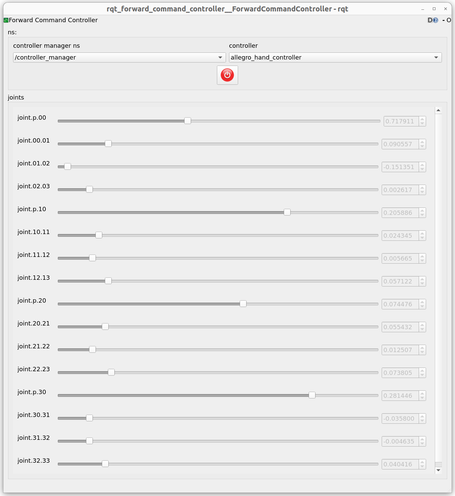

# RQT Forward Command Controller

`rqt_forward_command_controller` is a graphical user interface (GUI) plugin for interacting with `forward_command_controller` instances. This tool allows users to monitor running controllers and send commands directly to the joints, making it easy to test the robot's movements.



## Features

* **Auto-discovery of Controllers**: Dynamically finds available `controller_manager` namespaces and active `forward_command_controller` instances, displaying them in dropdown menus.
* **Intuitive Joint Control**: Easily adjust the target position for each joint using GUI sliders or precise numerical input boxes.
* **Real-time State Visualization**: Updates the GUI in real-time to show the current joint positions as reported by the controller.
* **Safe Control Modes**: Provides a power button to start/stop sending commands, allowing switching between "Monitor Mode" and "Control Mode".
* **URDF-based Joint Limits**: Automatically reads the URDF from the `robot_description` parameter to set the position limits (min/max) for each joint.

## Prerequisites

* A running ROS 2 environment.
* An instance of `forward_command_controller` from the `ros2_controllers` package must be loaded and active.
* The `robot_description` parameter, containing a URDF with valid joint `limit` tags, must be published on the ROS parameter server.

## Installation

1.  **Create a workspace and clone the source code**:
    ```bash
    mkdir -p ~/ros2_ws/src
    cd ~/ros2_ws/src
    git clone rqt_forward_command_controller_repo(FIXME)
    ```

2.  **Install dependencies**:
    ```bash
    cd ~/ros2_ws
    rosdep install --from-paths src --ignore-src -r -y
    ```

3.  **Build the package**:
    ```bash
    colcon build --packages-select rqt_forward_command_controller
    ```

4.  **Source the environment**:
    ```bash
    source ~/ros2_ws/install/setup.bash
    ```

## How to Use

1.  Launch your robot's simulation or hardware with the `forward_command_controller` loaded.
2.  In a new terminal, source the `setup.bash` file from the workspace you built.
3.  Run `rqt` and select **Plugins** > **Robot Tools** > **Forward Command Controller**, or run it standalone with the following command:
    ```bash
    rqt --standalone rqt_forward_command_controller
    ```
4.  Once the GUI appears, follow these steps:
    * Select your controller manager from the **`controller manager ns`** dropdown menu.
    * Select the `forward_command_controller` you want to control from the **`controller`** dropdown menu.
    * The controller's joints and their control widgets (sliders, input boxes) will appear in the `joints` group box.
    * Click the central **power button** to enable/disable control mode.
        * **Disabled (Off)**: The GUI will display the controller's current state (Monitor Mode).
        * **Enabled (On)**: The values from the GUI's sliders/input boxes will be sent as commands to the controller (Control Mode).

## Node and Plugin Details

### Plugin
* **`rqt_forward_command_controller.forward_command_controller.ForwardCommandControllerPlugin`**
    * This is the main plugin that runs within `rqt_gui`. It handles all the GUI logic, including controller discovery, state reception, and command transmission.

### Published Topics
* **`/<controller_name>/commands`** (`std_msgs/msg/Float64MultiArray`)
    * Publishes an array of target joint positions set by the user in the GUI.

### Subscribed Topics
* **`/dynamic_joint_states`** (`control_msgs/msg/DynamicJointState`)
    * Subscribes to the robot's joint states to update the current positions in the GUI.
* **`/robot_description`** (`std_msgs/msg/String`)
    * Subscribes to the robot's URDF to parse joint limits.

### Services Used
* **`/controller_manager/list_controllers`** (`controller_manager_msgs/srv/ListControllers`)
    * Queries the Controller Manager service to get the list and status of available controllers.

## License

This package is distributed under the Apache 2.0 License. See the `LICENSE` file for more details.